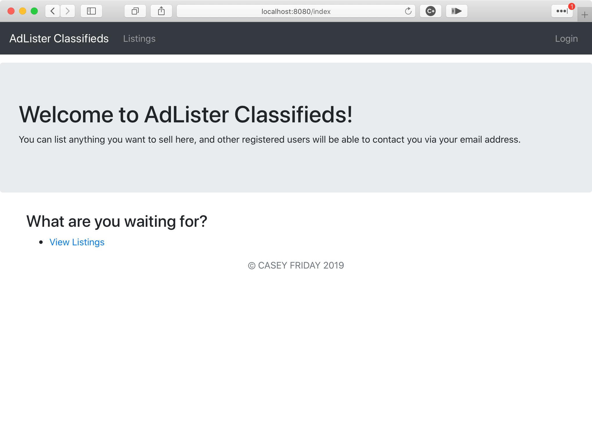

# AdLister Project

This project displays my ability to learn and deploy Java and Spring in a very short period of time. The purpose of this project is to simulate an online classifieds website, where users can post items and contact other sellers to purchase.

_This project was effectively done over the course of approximately 5 days, which includes learning all the relevant Java / Spring / framework skills necessary to put this project together._
## Run Locally

To build this project yourself, you'll need to import the repository into your IDE of choice. Allow Maven to update the project and download all necessary dependencies.

### MySQL

This app depends on a MySQL database called **classifiedsDB** in order to function. It also needs the following tables:
* users
* listings

Once you have created the database with the aforementioned tables, run your MySQL service on port **8889**. (You can also change this port in the _application.properties_ file.

## Authentication

Authentication is not fully implemented yet; however, you may use the following credentials to log into the test site (at http://localhost:8080/login) to view it in its current state:

username | password
--- | ---
casey | dontcrackmeplease

## Screenshots

